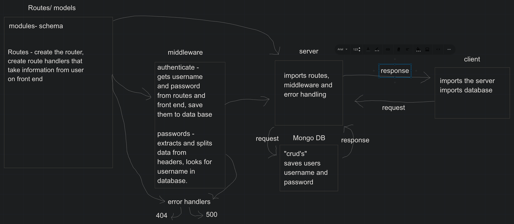

# LAB - Class 6

## Project: Basic-Authorization

### Author: Kale Lesko

### Links and Resources

- [ci/cd](https://password-practice.herokuapp.com/)
- [back-end server url](http://xyz.com)
- [front-end application](http://xyz.com)

### Setup

.
├── LICENSE
├── README.md
├── auth-server
│   ├── app.js
│   ├── package-lock.json
│   └── package.json
└── passwords
├── app.js
├── package-lock.json
└── package.json

#### `.env` requirements

- `PORT` - 3333
- `MONGODB_URI` - mongodb://localhost:27017/basic-auth

##### auth-server

- base-64
- bcrypt
- cors
- express
- mongoose

##### passwords

- base-64
- bcrypt

#### How to initialize/run your application

- `npm init -y`
- `npm start`
- `node index.js`

#### How to use your library

#### Tests

- How do you run tests?
- Any tests of note?
- Describe any tests that you did not complete, skipped, etc

#### UML

